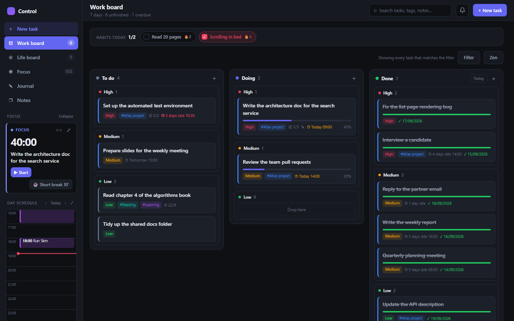
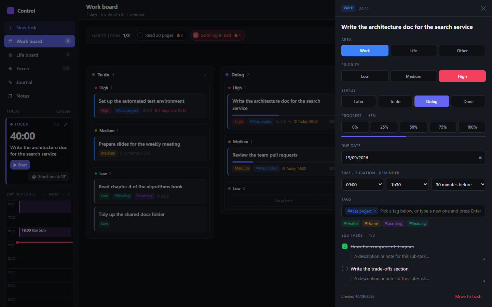
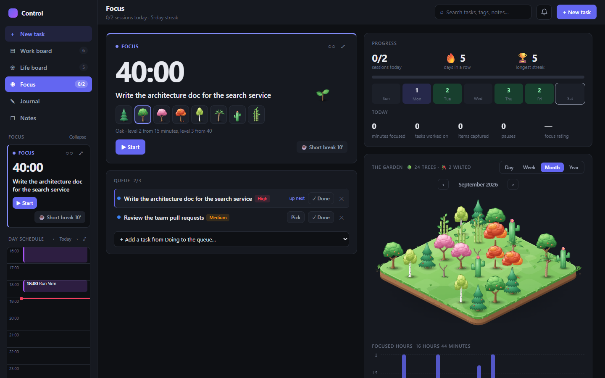
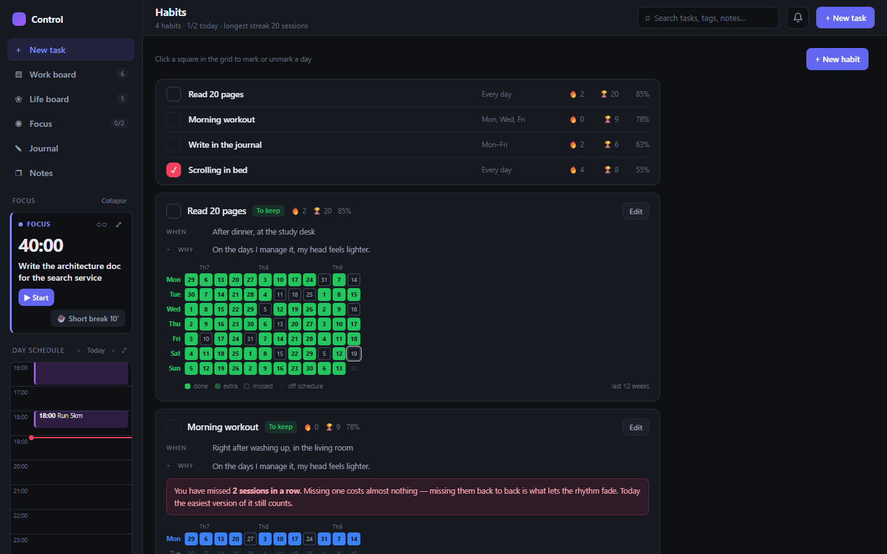
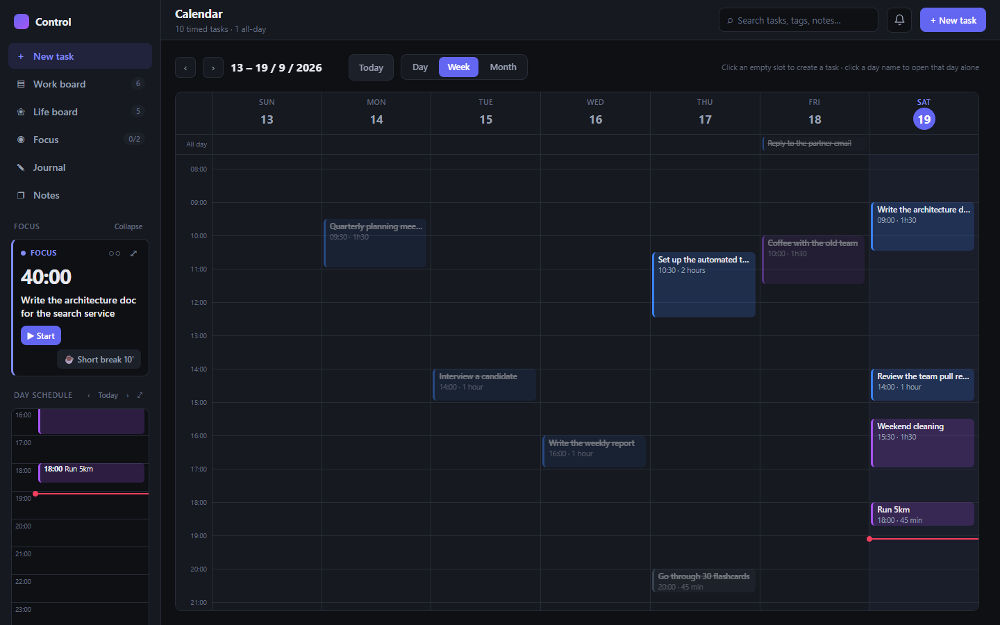
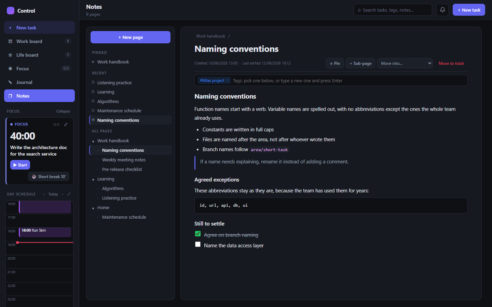
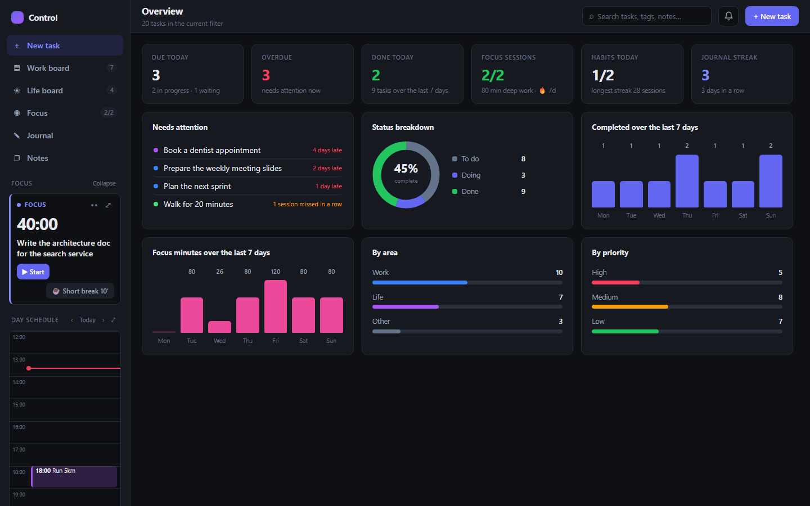
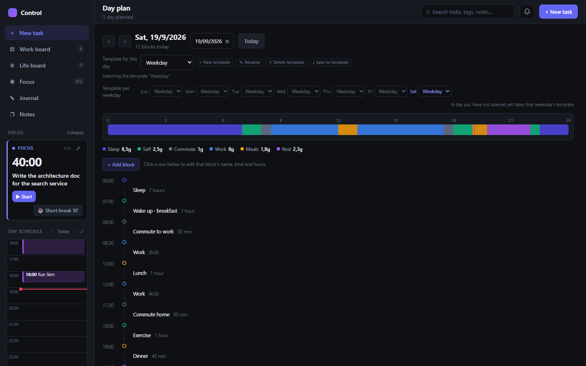
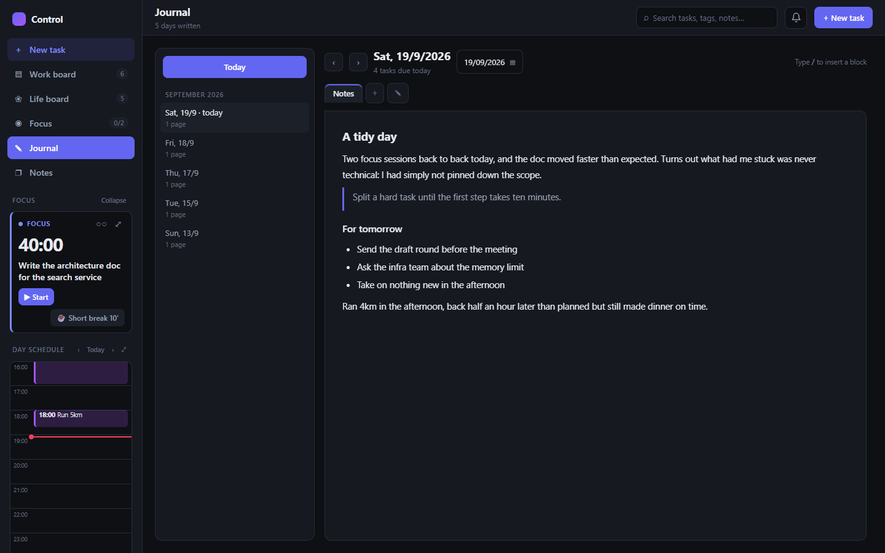

# Control Center

**One app for your tasks, habits, focus sessions, calendar, journal and notes. It runs on your own machine — no account, no internet, no cloud.**

*English · [Tiếng Việt](README.vi.md)*



- **The data is yours.** Everything lives in a single file, `data/dieukhien.json`, on your disk. Nothing is sent anywhere.
- **Clearing your browser cache does not lose anything.** The data is written to a file rather than trapped in the browser, and the app keeps a daily backup.
- **Nothing complicated to install.** Python and a browser is the whole list. On Windows, double-click `run.bat`.
- **English or Vietnamese.** Switch the interface language with the 🌐 button at the bottom of the sidebar.

---

## Contents

- [What's in it](#whats-in-it)
- [Install and run](#install-and-run)
- [How to use it](#how-to-use-it)
- [Data and backups](#data-and-backups)
- [Updating](#updating)
- [Shortcuts and tips](#shortcuts-and-tips)
- [FAQ](#faq)
- [For people who want to change the code](#for-people-who-want-to-change-the-code)

---

## What's in it

| | |
|---|---|
| **Work board & Life board**<br>Three-column kanban with drag and drop. Tasks carry priority, due date, time, tags, sub-tasks and a Notion-style note. | **Focus (pomodoro)**<br>A task queue, a full-screen timer, day streaks and stats. Every completed session plants a tree in the garden — eight species to pick from. |
|  |  |
| **Habits**<br>A twelve-week tracking grid, session streaks, and habits to keep as well as habits to drop. | **Calendar**<br>Day, week and month views in the style of Google Calendar. Click an empty slot to create a task there. |
|  |  |
| **Notes**<br>Pages nested inside pages like Notion. Drag to reorder or to nest, pin, tag, paste images and attach files. | **Overview**<br>What is due today, what is overdue, focus sessions against the daily goal, habits and the journal streak, plus seven-day charts. |
|  |  |
| **Day plan**<br>The shape of a day — sleep, commute, work, meals, rest — built from a template per weekday. | **Journal**<br>One or more pages per day, written in the same editor as the notes. |
|  |  |

There is also:

- **Later:** somewhere to jot the things you have not committed to yet. They stay off the board, the calendar and the stats.
- **Reminders:** a toast, an in-app bell, and a system notification if you allow one.
- **Coloured tags, full-text search, filters.**
- **Trash:** deleted tasks and note pages can be restored.

Every feature described in detail: see [docs/GUIDE.md](docs/GUIDE.md).

> The screenshots use made-up sample data, not anyone's real data.

---

## Install and run

### Step 1: Install Python (once)

The app needs **Python 3.7 or newer** (tested on 3.12). It uses only the standard library — there is nothing to `pip install`.

- **Windows:** download it from [python.org/downloads](https://www.python.org/downloads/). On the first installer screen, **tick "Add python.exe to PATH"**.
- **macOS:** `python3` is usually already there. If not, install from python.org or run `brew install python`.
- **Linux:** most distributions ship `python3`.

To check, open a terminal and run `python --version` (or `python3 --version`).

**Browser:** Chrome or Edge are the two the app is used and tested on daily. The "Link a file on disk" feature only exists in Chrome and Edge.

**Operating system:** the app is built and used on Windows. `serve.py` only uses the Python standard library, so it runs on macOS and Linux too, but those two are not tested as thoroughly.

### Step 2: Get the app

Either way works:

- **If you don't use Git:** click the green **Code → Download ZIP** button on GitHub, then unzip it.
- **With Git:**
  ```bash
  git clone https://github.com/WandererGuy/best-app-todo.git
  ```

> **Put the folder somewhere permanent**, for example `D:\Apps\control-center`. Your data will live inside this folder, so keep it out of `Downloads` where you might clear it by accident.

### Step 3: Run it

**Windows:** double-click **`run.bat`**.

A console window opens, and after a few seconds your browser opens `http://localhost:8000`.

**macOS / Linux:** open a terminal in the app folder and run:

```bash
python3 serve.py
```

Then open **http://localhost:8000**.

### Stopping it

- **Windows:** close the console window.
- **macOS / Linux:** press `Ctrl + C` in the terminal.

If you stop the server while a tab is still open, the app shows a red warning. Your changes are held in the browser and sent to disk the next time it connects.

### The first time you open it

- The app creates a few sample tasks, habits and a journal page so there is something to look at. Delete them once you have the hang of it.
- To get reminders while you are in another window, go to **Focus → ⚙ Settings** and click the button that asks for system notification permission.
- **Tip:** put a shortcut to `run.bat` on your desktop.

> **Don't open `index.html` directly.** The app still works, but then the data only lives in the browser and clearing the cache loses it. Always go through `run.bat` or `serve.py`.

---

## How to use it

The app opens on the **Work board**. What follows runs from the parts you will open every day down to the ones you will only need now and then, so it is worth reading in order.

### The first three things to do

1. **Create a real task.** Click **+ New task** at the top right, or **New task** at the top of the sidebar. A title alone is enough to create it — area, priority, due date, time, tags and sub-tasks can all stay empty and be filled in later. If you do set a **time**, the task appears on the day schedule in the sidebar and the app reminds you before it starts.

2. **Drag it to the Doing column.** The board has three columns, `To do / Doing / Done`, and cards drag between them. Click a card to open the panel on the right, where every field is editable and you can tick sub-tasks and write a longer note.

3. **Run one focus session.** Drag a card out of the **Doing** column and drop it on the **Focus** block in the sidebar, then click **▶ Start**. A session is 40 minutes by default. When the time is up the app chimes, asks you to rate the session, and plants a tree in the garden.

Those three steps cover the core of the app. Everything else can wait for another day.

### The parts you'll use every day

**Work board and Life board** — two separate kanban boards of the same kind. The work board holds the Work and Other areas, the life board holds the Life area. They are split so household errands don't end up mixed in with office work, but both boards share the same calendar, reminders and overview. The toolbar has a **Filter** button (by time range, priority, due state and area) and a **Zen** button for when you want the cards stripped back to just the task name.

**Focus** — the small block in the sidebar is where you start and pause each day; open the full Focus view when you want to see the queue, your progress and the garden. A few things worth knowing early:

- The queue **only accepts tasks in the Doing column**, up to three of them. This trips up most newcomers: a task sitting in To do cannot be dropped in.
- If something else pops into your head mid-session, type it into the **Save for later** box and press Enter. It lands in **Later**, and you don't have to break the session.
- Click **⤢** for full screen, `Esc` to come back.
- Every setting — durations, how many sessions before a long break, sound, notifications — lives under **⚙ Settings** inside the Focus view.

**Habits** — you tick habits on the **strip at the top of the Work board**, without opening the Habits page at all. Open the page itself when you want to add a habit or read the twelve-week grid to see which weekday you keep breaking on.

**Day schedule in the sidebar** — a 24-hour timeline for today. Click an empty slot to open the new-task form with the date and time already filled in; click a block to open that task.

**Journal** — one or more pages per day, written freely. The editor works like Notion's: type `/` to insert a block, and you can paste images and attach files.

**Notes** — pages that aren't tied to a date: handbooks, conventions, things you look up again. Pages nest inside pages; drag one onto the edge of another to reorder, or onto the middle of a page to make it a sub-page.

### The parts you'll open when you need them

These sit under the **Less used** label in the sidebar.

| Where | When to open it |
|---|---|
| **Calendar** | When you want a whole week or month at once. Day and Week are hour grids in the style of Google Calendar; click an empty slot to create a task at that hour. |
| **Day plan** | When you want to lay out the shape of a day — sleep, commute, work, meals, rest. Adjust the blocks to match your real day, then click **⤓ Save to template**; from there each weekday can have its own template. |
| **Habits** | Adding and editing habits, or reading the twelve-week grid. |
| **Later** | Where the uncommitted things go. Type in the box at the top and press Enter to jot one down. Tasks here stay off the board, the calendar and the reminders, and don't count towards the overview. |
| **Overview** | For starting the day and for looking back at the end of a week: what is due today, what is overdue, focus sessions, habits, the journal streak, the overdue work waiting for you, the seven-day charts, and the split by status, area and priority. |
| **Trash** | Where a task or note page goes when you delete one, and where you get it back. |

### The small things scattered around

- **The search box** in the top bar covers titles, tags, notes and sub-tasks.
- **Tags** in the sidebar: click one to filter, or click **Manage** to add, rename and recolour.
- **The bell** next to the search box keeps the reminders that have already fired, in case you missed a toast. If system notifications are still off, you can turn them on from that panel.
- **🌐** at the bottom of the sidebar switches the interface between English and Vietnamese.
- **Export / Import** at the bottom of the sidebar: see [Data and backups](#data-and-backups).

Editor shortcuts and drag-and-drop tips: see [Shortcuts and tips](#shortcuts-and-tips). Every feature in full: [docs/GUIDE.md](docs/GUIDE.md).

---

## Data and backups

### Where the data lives

| Path | What it is |
|---|---|
| `data/dieukhien.json` | **Everything:** tasks, habits, journal, notes, focus history, attached images. |
| `data/backups/` | Automatic backups. |

The `data/` folder is created on the first run. It is **not tracked by Git**, so your data never reaches GitHub.

Every change is written to disk about a second later. The bottom of the sidebar shows **Saved to disk at …** with the time. If that line turns red, nothing is being saved — see the [FAQ](#faq).

### Automatic backups (nothing to do)

The app puts copies into `data/backups/` by itself. The names are Vietnamese, since that is the language the app was first written in:

| File name | When |
|---|---|
| `ngay-YYYY-MM-DD.json` | On the first save of each day. **The last 30 days are kept.** |
| `truoc-khi-nap-*.json` | Right before **Import** overwrites your data. |
| `trinh-duyet-*.json` | Browser-held data that was not used, for instance when two windows edited at once. |

### Manual backups (worth doing as well)

The automatic backups sit on the same disk as the data, so a failed drive or a lost machine takes both. Keep **one copy somewhere else**:

1. **Export:** click **Export** at the bottom of the sidebar. You get `dieukhien-<date>.json`, images and attachments included. Put it on a USB stick, Google Drive, OneDrive…
2. **Copy the folder:** now and then, copy the whole `data/` folder somewhere else.
3. **Automatic, to the cloud (Chrome/Edge):** click **Link a file on disk** and pick a `.json` file inside your OneDrive or Google Drive folder. From then on every change is also written there, and the cloud service keeps the version history for you. Next time you open the app, one click reconnects it.

### Restoring from a backup

1. Open the app as usual.
2. Click **Import** at the bottom of the sidebar.
3. Pick the file to restore: one from `data/backups/`, or one you exported.
4. Confirm the overwrite.

Picking the wrong file is not a disaster: the current data is saved as `truoc-khi-nap-*.json` before anything is overwritten.

### Moving to another machine

1. Install the app on the new machine following [Install and run](#install-and-run).
2. Copy the `data/` folder from the old machine into the app folder on the new one, **while the app on the new machine is closed**.
   Or: click **Export** on the old machine and **Import** on the new one.

### What does and doesn't lose data

Running through `run.bat` / `serve.py`, you do **not** lose data by: clearing the browser cache, running CCleaner, switching Chrome accounts, switching browsers, or a sudden shutdown (at worst the last few seconds).

You **will** lose data by:

- Deleting the app folder or the `data/` folder.
- Running `git clean -x` — it removes untracked files, and `data/` is one of them.
- A failed drive or a lost machine with no backup kept elsewhere.

---

## Updating

The data sits apart in `data/`, so updating the code doesn't touch it.

**If you cloned with Git:**

```bash
git pull
```

**If you downloaded the ZIP:**

1. Close the app.
2. Download the new ZIP and unzip it into a new folder.
3. **Copy the `data/` folder from the old folder into the new one.**
4. Run the app from the new folder. Check your data is all there before deleting the old folder.

After updating, press **F5** if the app is still open in a tab.

---

## Shortcuts and tips

**Inside a note or journal page** (the Notion-style editor):

| Type | Result |
|---|---|
| `/` | Block menu: headings, lists, quote, code, image, file… |
| `# ` `## ` `### ` | Large / medium / small heading |
| `[] ` | Checklist item |
| `- ` or `1. ` | Bulleted / numbered list |
| `> ` | Quote |
| ` ``` ` | Code block |
| `---` | Horizontal rule |
| `Ctrl + B` / `I` / `E` / `K` | Bold / italic / inline code / link |
| `Ctrl + V` or drag and drop | Paste an image, attach a file (25MB each) |

**Everywhere:**

- `Esc` closes panels, menus and pickers, and leaves full screen.
- Drag a card **to the bottom of the screen** to trash it, onto **Later** in the sidebar to set it aside, or onto the **Focus** block to queue it.
- Mid-session and something else comes to mind: type it into **Save for later** and press Enter. It goes to Later and you carry on with what you were doing.
- Click an empty slot on either calendar — the full one or the small one in the sidebar — to create a task at that hour.
- In the note tree, drop a page on the top or bottom edge of another to reorder it, or in the middle of a page to make it a sub-page.

---

## FAQ

<details>
<summary><b><code>run.bat</code> says "Khong tim thay Python"</b></summary>

That message means Python was not found. Either it isn't installed, or it was installed without **Add python.exe to PATH**. Reinstall Python with that box ticked, then run `run.bat` again.
</details>

<details>
<summary><b>Port 8000 is already in use</b></summary>

`run.bat` names the program holding the port. Close that program, or move the app to another port in all three places:

- `serve.py`: the line `PORT = 8000`
- `run.bat`: two occurrences of `http://localhost:8000`
- `tat-server-cu.ps1`: the line `$Port = 8000`

Your data stays in `data/` and is unaffected. Only the small settings kept in the browser — the linked file, for instance — need setting up again.
</details>

<details>
<summary><b>The sidebar shows a red "Not saved to disk"</b></summary>

The app cannot reach the server. Check whether the `run.bat` console window is still open and start it again if not. Changes made while it was disconnected are kept in the browser and sent once the server is back.
</details>

<details>
<summary><b>"Edited in another window — reload the page"</b></summary>

You have the app open in two tabs or windows, and the other one saved first. The app refuses to overwrite it: this tab's version is filed into `data/backups/` instead. Press **F5** to pick up the latest data.
</details>

<details>
<summary><b>Can I use it from my phone, or another machine on the network?</b></summary>

No. The server only listens on the machine it runs on (`localhost`), so nobody else on the same Wi-Fi can read or change your data.
</details>

<details>
<summary><b>Reminders aren't showing</b></summary>

Reminders only run while the app is open in some tab. To be told even when you are in another window, allow system notifications under **Focus → ⚙ Settings**.
</details>

<details>
<summary><b>I want to wipe everything and start over</b></summary>

Close the app, **rename** the `data/` folder — to `data-old/` for instance, rather than deleting it, in case you want it back — then start the app again. Details in [RUN.md](RUN.md) (Vietnamese only).
</details>

---

## Privacy

- No account, no tracking, nothing sent to the internet.
- The server listens on `localhost` only, and rejects calls from other web pages.
- The data is plain JSON — any text editor can read it.

---

## For people who want to change the code

The app is plain HTML, CSS and JavaScript. No framework, and **no build step**: edit a file, press F5, see it. The editor is [TipTap](https://tiptap.dev/), already bundled into `vendor/tiptap.js`. The server is one Python file using only the standard library.

```
run.bat, tat-server-cu.ps1   Double-click to run (Windows); clears a leftover server
serve.py                     Localhost server: static files + the /api/data store
index.html                   The HTML shell
style.css                    The entire interface
js/                          App code, one file per area (i18n.js then core.js first, main.js last)
js/i18n.js                   Every string in the interface, one line each as [Vietnamese, English]
vendor/tiptap.js             The editor bundle (generated — don't hand-edit)
build/                       Source and build script for the editor (needs Node)
docs/                        The detailed guide and the screenshots
data/                        Your data (never committed)
```

[docs/GUIDE.md](docs/GUIDE.md) covers every feature and the [data format](docs/GUIDE.md#data-format). [RUN.md](RUN.md) — how the server saves, the startup sequence, rebuilding the editor — is still Vietnamese only, as are the comments in the source. The code itself, including identifiers and commit messages, is in English.
