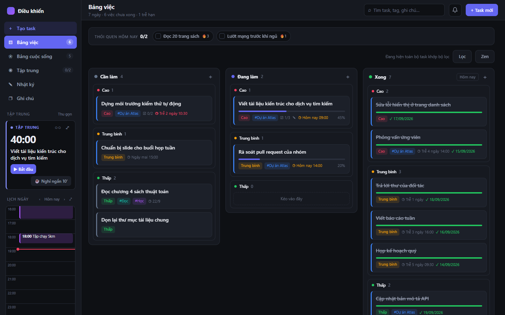
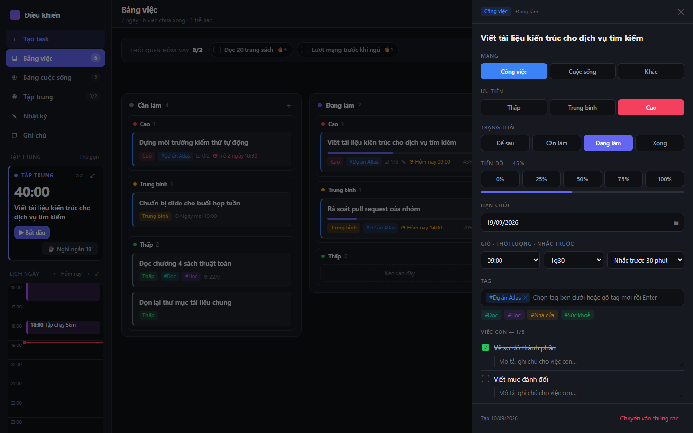
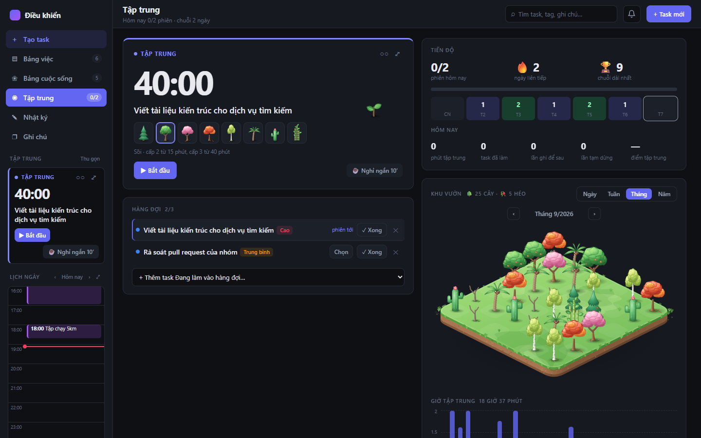
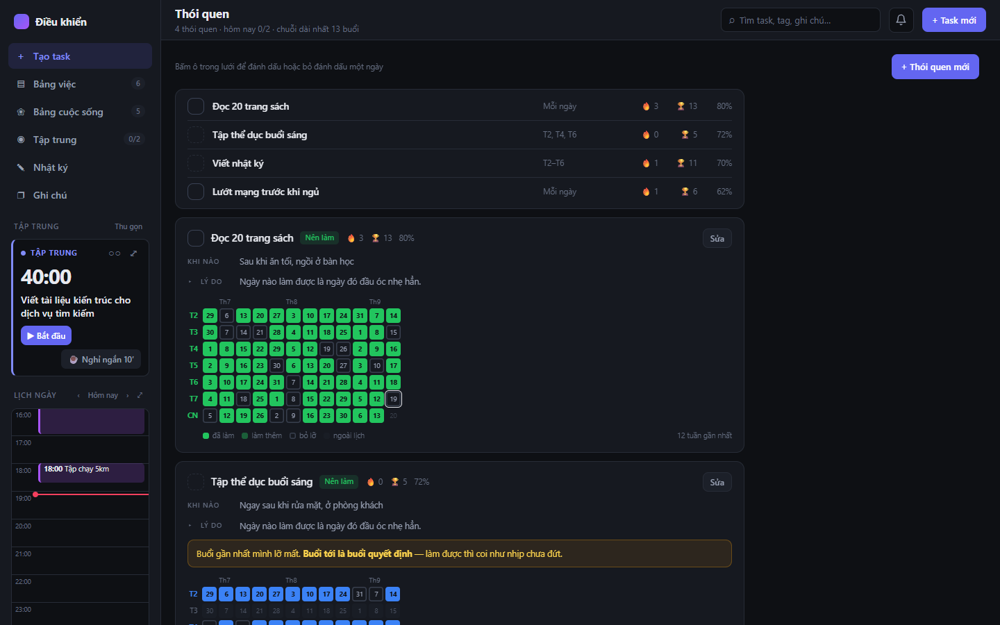
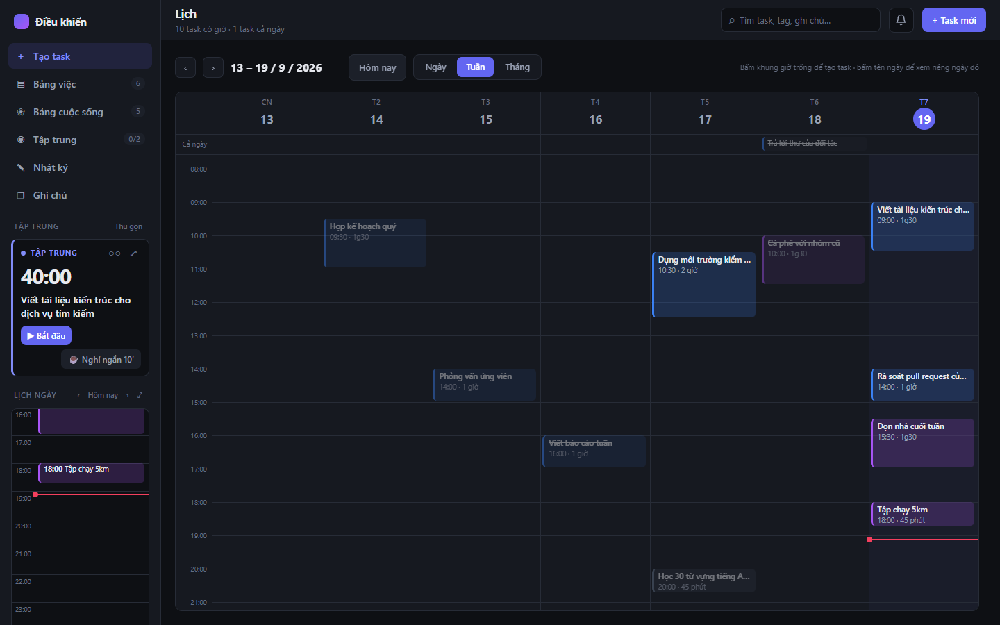
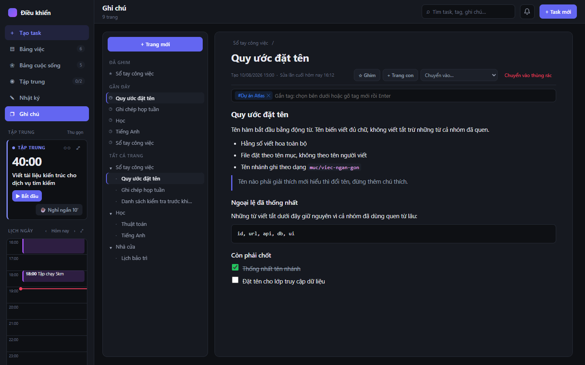
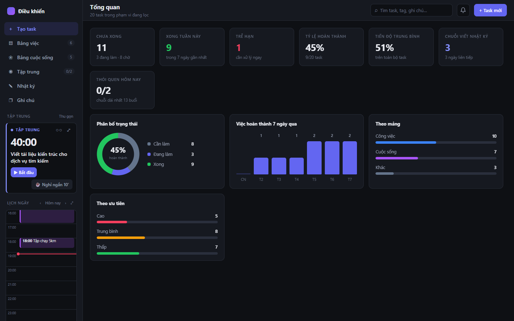
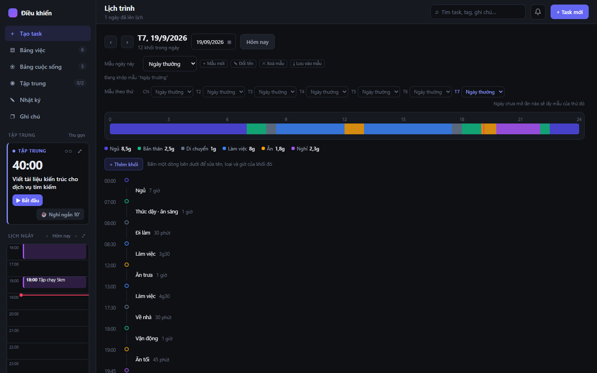
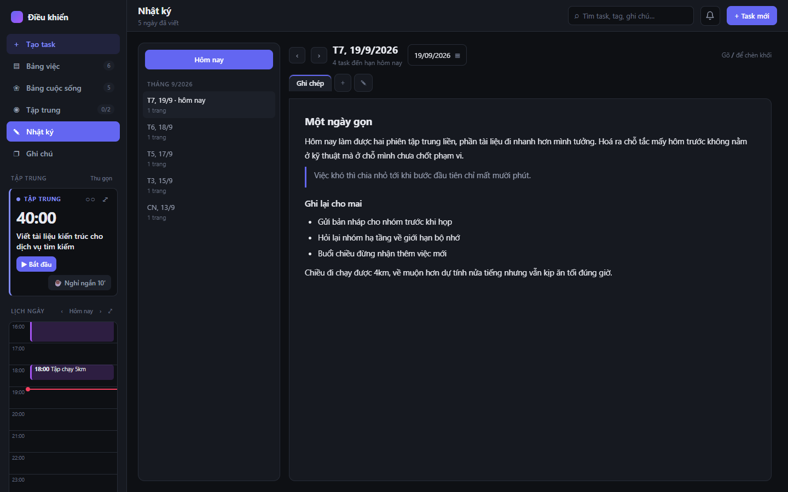

# Trung tâm điều khiển

**Một app duy nhất để quản lý việc cần làm, thói quen, giờ tập trung, lịch, nhật ký và ghi chú. Chạy ngay trên máy của bạn, không cần tài khoản, không cần internet.**

*[English](README.md) · Tiếng Việt*



- **Dữ liệu là của bạn.** Mọi thứ nằm trong một file `data/dieukhien.json` trên máy. Không gửi đi đâu, không có máy chủ đám mây.
- **Không mất dữ liệu vì xoá cache.** Dữ liệu ghi ra file chứ không nhốt trong trình duyệt, và mỗi ngày app tự sao lưu một bản.
- **Không cần cài gì phức tạp.** Chỉ cần Python và một trình duyệt. Bấm đúp `run.bat` là chạy.
- **Tiếng Việt hoặc tiếng Anh.** Đổi ngôn ngữ giao diện bằng nút 🌐 ở cuối sidebar.

---

## Mục lục

- [Có những gì](#có-những-gì)
- [Cài đặt và chạy](#cài-đặt-và-chạy)
- [Hướng dẫn dùng](#hướng-dẫn-dùng)
- [Dữ liệu và sao lưu](#dữ-liệu-và-sao-lưu)
- [Cập nhật lên bản mới](#cập-nhật-lên-bản-mới)
- [Phím tắt và mẹo](#phím-tắt-và-mẹo)
- [Câu hỏi thường gặp](#câu-hỏi-thường-gặp)
- [Dành cho người muốn sửa code](#dành-cho-người-muốn-sửa-code)

---

## Có những gì

| | |
|---|---|
| **Bảng việc & Bảng cuộc sống**<br>Kanban 3 cột kéo thả. Task có ưu tiên, hạn chót, giờ, tag, việc con và ghi chú kiểu Notion. | **Tập trung (pomodoro)**<br>Hàng đợi task, đồng hồ toàn màn hình, chuỗi ngày, thống kê. Mỗi phiên đủ giờ trồng một cây trong khu vườn, chọn được 8 loài. |
|  |  |
| **Thói quen**<br>Lưới theo dõi 12 tuần, chuỗi buổi liên tiếp, thói quen nên làm và nên bỏ. | **Lịch**<br>Xem theo ngày, tuần, tháng kiểu Google Calendar. Bấm khung trống để tạo task. |
|  |  |
| **Ghi chú**<br>Trang lồng nhau như Notion, kéo thả để đổi thứ tự hoặc lồng vào trang khác, ghim, gắn tag, chèn ảnh và file đính kèm. | **Tổng quan**<br>Tỉ lệ hoàn thành, việc trễ hạn, biểu đồ 7 ngày, phân bố theo mảng và ưu tiên. |
|  |  |
| **Lịch trình**<br>Khung của một ngày — ngủ, di chuyển, làm việc, ăn, nghỉ — dựng sẵn thành mẫu cho từng thứ trong tuần. | **Nhật ký**<br>Mỗi ngày một hoặc nhiều trang, viết bằng cùng trình soạn thảo với ghi chú. |
|  |  |

Ngoài ra còn có:

- **Để sau:** chỗ ghi nhanh những việc chưa muốn làm ngay. Chúng không lên bảng, lịch hay thống kê.
- **Nhắc việc:** toast, chuông trong app và thông báo hệ thống.
- **Tag có màu, tìm kiếm toàn văn, bộ lọc.**
- **Thùng rác:** khôi phục được task và ghi chú đã xoá.
- **Hai ngôn ngữ:** toàn bộ giao diện có tiếng Việt và tiếng Anh, đổi ở cuối sidebar.

Mô tả chi tiết từng tính năng: xem [docs/HUONG-DAN.md](docs/HUONG-DAN.md).

> Ảnh chụp dùng dữ liệu minh hoạ, không phải dữ liệu thật.

---

## Cài đặt và chạy

### Bước 1: Cài Python (chỉ làm một lần)

App cần **Python 3.7 trở lên** (đã kiểm với 3.12). Nó chỉ dùng thư viện có sẵn của Python, không cần `pip install` gì thêm.

- **Windows:** tải ở [python.org/downloads](https://www.python.org/downloads/). Khi cài, nhớ **tick ô "Add python.exe to PATH"** ở màn hình đầu tiên.
- **macOS:** thường đã có sẵn `python3`. Nếu chưa, cài từ python.org hoặc `brew install python`.
- **Linux:** hầu hết các bản đã có sẵn `python3`.

Kiểm tra bằng cách mở Terminal / Command Prompt rồi gõ `python --version` (hoặc `python3 --version`).

**Trình duyệt:** nên dùng Chrome hoặc Edge, là hai trình duyệt app được dùng và kiểm tra hằng ngày. Tính năng "Liên kết file trên ổ đĩa" chỉ có trên Chrome và Edge.

**Hệ điều hành:** app được làm và dùng trên Windows. `serve.py` chỉ dùng thư viện chuẩn của Python nên chạy được trên macOS / Linux, nhưng chưa được kiểm kỹ trên hai hệ này.

### Bước 2: Tải app về

Chọn một trong hai cách:

- **Không biết Git:** bấm nút xanh **Code → Download ZIP** trên trang GitHub, rồi giải nén.
- **Dùng Git:**
  ```bash
  git clone https://github.com/WandererGuy/best-app-todo.git
  ```

> **Đặt thư mục app ở chỗ cố định**, ví dụ `D:\Apps\trung-tam-dieu-khien`. Dữ liệu của bạn sẽ nằm ngay trong thư mục này, nên đừng để nó trong `Downloads` rồi lỡ tay xoá.

### Bước 3: Chạy

**Windows:** bấm đúp **`run.bat`**.

Một cửa sổ đen hiện ra, và sau vài giây trình duyệt tự mở `http://localhost:8000`.

**macOS / Linux:** mở Terminal trong thư mục app rồi chạy:

```bash
python3 serve.py
```

Sau đó mở trình duyệt vào **http://localhost:8000**.

### Tắt app

- **Windows:** đóng cửa sổ đen.
- **macOS / Linux:** bấm `Ctrl + C` trong Terminal.

Nếu lỡ tắt server khi tab còn mở, app sẽ báo đỏ. Thay đổi vẫn được giữ tạm trong trình duyệt và tự gửi lên ở lần mở sau.

### Lần đầu mở

- App tạo sẵn vài task, thói quen và trang nhật ký mẫu để bạn xem thử. Xoá chúng đi khi đã quen.
- Muốn nhận nhắc việc khi đang ở cửa sổ khác: vào **Tập trung → ⚙ Cài đặt** và bấm **Cho phép thông báo hệ thống**.
- **Mẹo:** tạo shortcut của `run.bat` ra Desktop để mở nhanh mỗi ngày.

> **Đừng mở thẳng file `index.html`.** App vẫn chạy, nhưng khi đó dữ liệu chỉ nằm trong trình duyệt và xoá cache là mất. Luôn chạy qua `run.bat` hoặc `serve.py`.

---

## Hướng dẫn dùng

App mở ra là thấy **Bảng việc**. Phần này đi từ những mục bạn sẽ mở mỗi ngày tới những mục thỉnh thoảng mới cần, nên cứ đọc theo thứ tự.

### Ba việc đầu tiên

1. **Tạo một task thật của bạn.** Bấm **+ Task mới** ở góc trên bên phải, hoặc **Tạo task** ở đầu sidebar. Chỉ cần điền tên là tạo được; mảng, ưu tiên, hạn chót, giờ, tag, việc con để trống cũng không sao, sửa sau lúc nào cũng được. Nếu bạn đặt **giờ**, task sẽ hiện luôn trên lịch ngày ở sidebar và app sẽ nhắc trước khi tới giờ.

2. **Kéo task sang cột Đang làm.** Bảng có 3 cột `Cần làm / Đang làm / Xong`, kéo thẻ qua lại giữa chúng. Bấm vào thẻ để mở panel bên phải: ở đó sửa được mọi trường, tick việc con và viết ghi chú dài.

3. **Chạy thử một phiên tập trung.** Kéo thẻ đang ở cột **Đang làm** thả vào khối **Tập trung** ở sidebar, rồi bấm **▶ Bắt đầu**. Mặc định một phiên là 40 phút. Hết giờ app kêu chuông, hỏi bạn chấm điểm phiên vừa rồi, và trồng một cây vào khu vườn.

Làm xong ba bước này là bạn đã đi qua phần lõi của app. Những mục còn lại đều có thể để hôm khác.

### Những mục dùng hằng ngày

**Bảng việc và Bảng cuộc sống** — hai bảng kanban riêng, cùng một kiểu. Bảng việc giữ mảng Công việc và Khác, Bảng cuộc sống giữ mảng Cuộc sống. Tách ra để việc nhà không trộn lẫn với việc cơ quan, nhưng hai bảng vẫn dùng chung lịch, nhắc việc và tổng quan. Trên thanh công cụ có nút **Lọc** (theo khoảng thời gian, ưu tiên, hạn, mảng) và nút **Zen** khi bạn muốn thẻ chỉ còn tên task.

**Tập trung** — khối nhỏ ở sidebar là chỗ bạn bấm bắt đầu và tạm dừng mỗi ngày; mở hẳn mục Tập trung khi muốn xem hàng đợi, tiến độ và khu vườn. Vài điều đáng biết sớm:

- Hàng đợi **chỉ nhận task ở cột Đang làm**, tối đa 3 task. Đây là chỗ nhiều người vướng lúc đầu: task ở Cần làm thì kéo vào không được.
- Đang làm mà chợt nhớ việc khác thì gõ vào ô **Ghi để sau** rồi Enter. Việc đó rơi vào mục **Để sau**, bạn không phải dừng phiên.
- Muốn tắt hẳn thứ khác thì bấm **⤢** để vào toàn màn hình, `Esc` để thoát.
- Mọi thông số (thời lượng, số phiên trước khi nghỉ dài, âm thanh, thông báo) đổi ở **⚙ Cài đặt** trong mục Tập trung.

**Thói quen** — bạn tick thói quen ngay trên **dải ở đầu Bảng việc**, không cần mở trang Thói quen. Trang riêng chỉ mở khi muốn thêm thói quen mới hoặc xem lưới 12 tuần để biết mình hay đứt vào thứ mấy.

**Lịch ngày ở sidebar** — dòng thời gian 24 giờ của hôm nay. Bấm một ô giờ trống là mở form tạo task với ngày giờ điền sẵn; bấm vào một block là mở đúng task đó.

**Nhật ký** — mỗi ngày một hoặc nhiều trang, viết tự do. Trình soạn thảo giống Notion: gõ `/` để chèn khối, dán được ảnh và file.

**Ghi chú** — những trang không gắn với ngày nào: sổ tay, quy ước, việc cần tra lại. Trang lồng trong trang, kéo thả để đổi thứ tự hoặc thả vào giữa một trang khác để biến nó thành trang con.

### Những mục khi cần mới mở

Nhóm này nằm dưới nhãn **Ít dùng** ở sidebar.

| Mục | Mở khi nào |
|---|---|
| **Lịch** | Muốn nhìn cả tuần hoặc cả tháng. Ngày và Tuần là lưới giờ kiểu Google Calendar, bấm khung trống để tạo task đúng giờ đó. |
| **Lịch trình** | Muốn dựng khung của một ngày — ngủ, di chuyển, làm việc, ăn, nghỉ. Sửa các khối cho khớp ngày thật của bạn rồi bấm **⤓ Lưu vào mẫu**, từ đó mỗi thứ trong tuần có mẫu riêng. |
| **Thói quen** | Thêm, sửa thói quen, hoặc xem lưới 12 tuần. |
| **Để sau** | Chỗ đổ những việc chưa cam kết làm. Gõ vào ô trên cùng rồi Enter để ghi nhanh. Task ở đây không lên bảng, lịch, nhắc việc và không tính vào tổng quan. |
| **Tổng quan** | Cuối tuần nhìn lại: tỉ lệ hoàn thành, việc trễ hạn, biểu đồ 7 ngày, phân bố theo mảng và ưu tiên. |
| **Thùng rác** | Lỡ tay bỏ task hay trang ghi chú thì vào đây khôi phục. |

### Mấy thứ nhỏ nằm rải rác

- **Ô tìm kiếm** trên thanh trên tìm cả tiêu đề, tag, ghi chú và việc con.
- **Tag** ở sidebar: bấm một tag để lọc, bấm **Quản lý** để thêm, đổi tên, đổi màu.
- **Chuông** cạnh ô tìm kiếm giữ lại các lời nhắc đã bắn, phòng khi bạn lỡ mất toast. Chưa bật thông báo hệ thống thì bật được ngay trong bảng này.
- **🌐** ở cuối sidebar đổi giao diện sang tiếng Anh và ngược lại.
- **Xuất file / Nạp file** ở cuối sidebar: xem [Dữ liệu và sao lưu](#dữ-liệu-và-sao-lưu).

Phím tắt của trình soạn thảo và các mẹo kéo thả: xem [Phím tắt và mẹo](#phím-tắt-và-mẹo). Mô tả đầy đủ từng tính năng: [docs/HUONG-DAN.md](docs/HUONG-DAN.md).

---

## Dữ liệu và sao lưu

### Dữ liệu nằm ở đâu

| Đường dẫn | Là gì |
|---|---|
| `data/dieukhien.json` | **Toàn bộ dữ liệu:** task, thói quen, nhật ký, ghi chú, lịch sử tập trung, ảnh đính kèm. |
| `data/backups/` | Các bản sao lưu tự động. |

Thư mục `data/` được tạo ở lần chạy đầu tiên. Nó **không được đưa lên Git**, nên dữ liệu của bạn không lọt lên GitHub.

Mỗi lần bạn sửa gì, app ghi ra file sau khoảng 1 giây. Góc dưới sidebar hiện **Đã lưu vào máy** kèm giờ. Nếu dòng này chuyển đỏ nghĩa là chưa lưu được, xem [Câu hỏi thường gặp](#câu-hỏi-thường-gặp).

### Sao lưu tự động (không cần làm gì)

App tự cất bản sao vào `data/backups/`:

| Tên file | Khi nào |
|---|---|
| `ngay-YYYY-MM-DD.json` | Lần lưu đầu tiên mỗi ngày. **Giữ 30 ngày gần nhất.** |
| `truoc-khi-nap-*.json` | Ngay trước khi bạn dùng **Nạp file** ghi đè dữ liệu. |
| `trinh-duyet-*.json` | Dữ liệu trong trình duyệt không được dùng, ví dụ khi hai cửa sổ cùng sửa. |

### Sao lưu thủ công (nên làm thêm)

Sao lưu tự động nằm cùng ổ đĩa với dữ liệu. Nếu hỏng ổ hay mất máy thì mất cả hai, nên hãy giữ thêm **một bản ở chỗ khác**:

1. **Xuất file:** bấm **Xuất file** ở cuối sidebar. Bạn nhận được `dieukhien-<ngày>.json` gồm cả ảnh và file đính kèm. Cất nó vào USB, Google Drive, OneDrive…
2. **Chép thư mục:** thỉnh thoảng chép cả thư mục `data/` sang chỗ khác.
3. **Tự động ra đám mây (Chrome/Edge):** bấm **Liên kết file trên ổ đĩa** rồi chọn một file `.json` nằm trong thư mục OneDrive / Google Drive. Từ đó mọi thay đổi tự ghi thêm ra file đó, và dịch vụ đám mây giữ lịch sử phiên bản giúp bạn. Lần mở app sau chỉ cần bấm một nút để kết nối lại.

### Khôi phục từ bản sao lưu

1. Mở app như bình thường.
2. Bấm **Nạp file** ở cuối sidebar.
3. Chọn file muốn khôi phục: bản trong `data/backups/` hoặc bản bạn đã xuất.
4. Xác nhận ghi đè.

Không sợ chọn nhầm: dữ liệu hiện tại được tự cất thành `truoc-khi-nap-*.json` trước khi bị ghi đè.

### Chuyển sang máy khác

1. Cài app trên máy mới theo [Cài đặt và chạy](#cài-đặt-và-chạy).
2. Chép thư mục `data/` từ máy cũ sang thư mục app ở máy mới, **khi app trên máy mới đang tắt**.
   Hoặc: bấm **Xuất file** ở máy cũ, rồi **Nạp file** ở máy mới.

### Những gì làm mất dữ liệu

Khi chạy qua `run.bat` / `serve.py`, bạn **không** mất dữ liệu khi: xoá cache trình duyệt, dùng CCleaner, đổi tài khoản Chrome, đổi trình duyệt, tắt máy đột ngột (cùng lắm mất vài giây cuối).

Bạn **sẽ** mất dữ liệu khi:

- Xoá thư mục app hoặc thư mục `data/`.
- Chạy `git clean -x` (lệnh này xoá cả những file không đưa lên Git, trong đó có `data/`).
- Hỏng ổ đĩa hoặc mất máy mà không có bản sao lưu ở chỗ khác.

---

## Cập nhật lên bản mới

Dữ liệu nằm riêng trong `data/`, nên cập nhật code không động tới dữ liệu.

**Nếu tải bằng Git:**

```bash
git pull
```

**Nếu tải bằng ZIP:**

1. Tắt app.
2. Tải ZIP mới và giải nén ra một thư mục mới.
3. **Chép thư mục `data/` từ thư mục cũ sang thư mục mới.**
4. Chạy app từ thư mục mới. Kiểm tra dữ liệu đủ rồi mới xoá thư mục cũ.

Sau khi cập nhật, nếu tab app đang mở thì bấm **F5**.

---

## Phím tắt và mẹo

**Trong ô ghi chú / nhật ký** (soạn thảo giống Notion):

| Gõ | Kết quả |
|---|---|
| `/` | Menu chèn khối: tiêu đề, danh sách, trích dẫn, code, ảnh, file… |
| `# ` `## ` `### ` | Tiêu đề lớn / vừa / nhỏ |
| `[] ` | Danh sách việc có ô tick |
| `- ` hoặc `1. ` | Gạch đầu dòng / danh sách đánh số |
| `> ` | Trích dẫn |
| ` ``` ` | Khối code |
| `---` | Đường kẻ ngang |
| `Ctrl + B` / `I` / `E` / `K` | Đậm / nghiêng / code / chèn link |
| `Ctrl + V` hoặc kéo thả | Dán ảnh, đính kèm file (tối đa 25MB mỗi file) |

**Khắp app:**

- `Esc`: đóng panel, menu, bảng chọn, thoát toàn màn hình.
- Kéo card trên bảng thả **xuống đáy màn hình** để bỏ vào thùng rác, thả vào mục **Để sau** ở sidebar để gác lại, thả vào khối **Tập trung** để đưa vào hàng đợi.
- Đang trong phiên tập trung mà chợt nhớ việc khác: gõ vào ô **Ghi để sau** rồi Enter. Việc đó vào mục Để sau, bạn quay lại việc đang làm.
- Bấm khung giờ trống trên lịch (lịch lớn hoặc lịch nhỏ ở sidebar) để tạo task đúng giờ đó.
- Trong cây ghi chú, kéo một trang thả vào mép trên / mép dưới của trang khác để đổi chỗ, thả vào giữa trang để biến nó thành trang con.

---

## Câu hỏi thường gặp

<details>
<summary><b>Bấm <code>run.bat</code> báo "Khong tim thay Python"</b></summary>

Python chưa được cài, hoặc cài mà quên tick **Add python.exe to PATH**. Cài lại Python và tick ô đó, rồi chạy lại `run.bat`.
</details>

<details>
<summary><b>Cổng 8000 đang bị chương trình khác dùng</b></summary>

`run.bat` sẽ báo tên chương trình đang chiếm cổng. Tắt chương trình đó, hoặc đổi sang cổng khác ở cả 3 chỗ:

- `serve.py`: dòng `PORT = 8000`
- `run.bat`: hai chỗ `http://localhost:8000`
- `tat-server-cu.ps1`: dòng `$Port = 8000`

Lưu ý: dữ liệu vẫn nằm trong `data/` nên không bị ảnh hưởng. Chỉ những thiết lập nhỏ lưu trong trình duyệt (ví dụ liên kết file) cần làm lại.
</details>

<details>
<summary><b>Sidebar báo đỏ "Chưa lưu vào máy"</b></summary>

App không nối được tới server. Kiểm tra cửa sổ đen của `run.bat` còn mở không, rồi chạy lại nếu cần. Thay đổi trong lúc mất kết nối vẫn được giữ trong trình duyệt và tự gửi lên khi server chạy lại.
</details>

<details>
<summary><b>Báo "Đã sửa ở cửa sổ khác — tải lại trang"</b></summary>

Bạn đang mở app ở hai tab / cửa sổ, và tab kia đã lưu trước. App không ghi đè để tránh mất thay đổi: bản của tab này được cất vào `data/backups/`. Bấm **F5** để lấy dữ liệu mới nhất.
</details>

<details>
<summary><b>Dùng trên điện thoại hoặc máy khác trong mạng được không?</b></summary>

Không. Server chỉ nghe trên chính máy đang chạy (`localhost`), để không ai trong cùng mạng Wi-Fi đọc hay sửa được dữ liệu của bạn.
</details>

<details>
<summary><b>Nhắc việc không hiện</b></summary>

Nhắc việc chỉ chạy khi app đang mở, trong một tab bất kỳ. Muốn được báo cả khi đang ở cửa sổ khác thì cho phép thông báo hệ thống trong **Tập trung → ⚙ Cài đặt**.
</details>

<details>
<summary><b>Muốn xoá sạch để dùng lại từ đầu</b></summary>

Tắt app, **đổi tên** thư mục `data/` (ví dụ thành `data-cu/`, đừng xoá, phòng khi cần lại), rồi chạy lại app. Chi tiết xem [RUN.md](RUN.md#xoá-sạch-để-test-từ-đầu).
</details>

---

## Quyền riêng tư

- Không tài khoản, không theo dõi, không gửi dữ liệu ra internet.
- Server chỉ nghe `localhost` và chặn các trang web lạ gọi vào.
- Dữ liệu là file JSON thuần, mở bằng bất kỳ trình soạn thảo nào cũng đọc được.

---

## Dành cho người muốn sửa code

App viết bằng HTML + CSS + JavaScript thuần, không framework và **không có bước build**: sửa file rồi F5 là thấy. Trình soạn thảo dùng [TipTap](https://tiptap.dev/), đã đóng gói sẵn trong `vendor/tiptap.js`. Server là một file Python chỉ dùng thư viện chuẩn.

```
run.bat, tat-server-cu.ps1   Bấm đúp để chạy (Windows); tắt server cũ còn sót
serve.py                     Server localhost: phát file tĩnh + API /api/data giữ dữ liệu
index.html                   Khung HTML
style.css                    Toàn bộ giao diện
js/                          Code app, mỗi mục một file (i18n.js rồi core.js nạp đầu, main.js nạp cuối)
js/i18n.js                   Chữ trong giao diện, mỗi dòng một chuỗi [tiếng Việt, tiếng Anh]
vendor/tiptap.js             Bundle trình soạn thảo (build sinh ra, không sửa tay)
build/                       Nguồn và script build lại trình soạn thảo (cần Node)
docs/                        Hướng dẫn chi tiết và ảnh chụp
data/                        Dữ liệu của bạn (không đưa lên Git)
```

Chi tiết kỹ thuật (cách server lưu và chống ghi đè, quy trình khởi động, build lại trình soạn thảo, lưu ý khi sửa code): xem [RUN.md](RUN.md). Định dạng dữ liệu: xem [docs/HUONG-DAN.md](docs/HUONG-DAN.md#định-dạng-dữ-liệu).
